# Arithmetic Derivatives Spike: Findings

This document summarizes the key findings from exploring three interrelated ideas:
1. The arithmetic derivative inverse D⁻¹ and its relationship to primes
2. K and K₂ commutators in relation to Riemann zeta zeros
3. Rule 110 cellular automata as a tool for exploring prime structure

---

## Part 1: D⁻¹ (Arithmetic Antiderivative)

### Key Discovery: Primes as D⁻¹(1)

The arithmetic derivative D is defined by:
- D(0) = D(1) = 0
- D(p) = 1 for any prime p
- D(ab) = aD(b) + bD(a) (product rule)

**The primes are exactly characterized as D⁻¹(1)** — the set of all integers with arithmetic derivative equal to 1.

This provides an alternative calculus-based definition of primality.

### Antiderivative Set Distribution

| k | |D⁻¹(k)| (up to 5000) | Notable elements |
|---|------------------------|------------------|
| 0 | 102 | {0, 1, 103, 107, 197, ...} |
| 1 | 569 | {all primes ≤ 5000} |
| 2 | 0 | ∅ (no solutions!) |
| 3 | 0 | ∅ (no solutions!) |
| 4 | 1 | {4} only |

**Observation**: D⁻¹(2) and D⁻¹(3) appear to be empty — no integer has arithmetic derivative 2 or 3. This is a known result: no n satisfies D(n) = 2 or D(n) = 3.

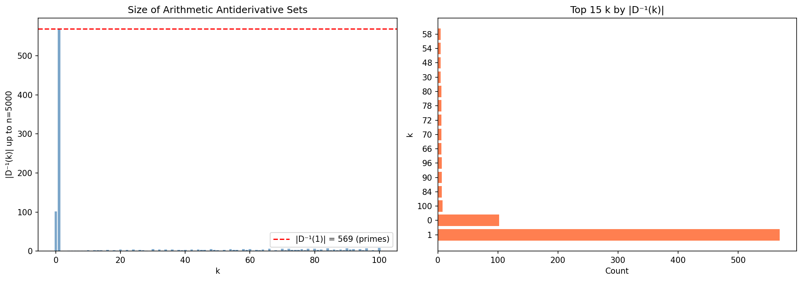

### Derivative Chains

Numbers form chains under repeated differentiation: n → D(n) → D(D(n)) → ...

**Key findings**:
- Primes have chain length 2: p → 1 → 0
- Fixed points exist at p^p: D(4)=4, D(27)=27, D(3125)=3125
- Longest chains start from powers of 2 near primes

| n | Chain length | Chain |
|---|--------------|-------|
| 8 | 20 | 8 → 12 → 16 → 32 → 80 → ... → 4463 |
| 12 | 20 | 12 → 16 → 32 → ... → 1 → 0 |
| 15 | 20 | 15 → 8 → 12 → ... |

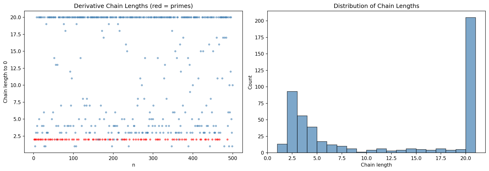

### K₂ Telescoping Property

For elements in the same D⁻¹(k) class:
```
Σ K₂(n) from a to b-1 = -(b - a)
```

This was verified for all prime pairs tested — confirming the algebraic identity.

---

## Part 2: K, K₂, and Riemann Zeroes

### K₂ Values at Riemann Zero Integers

| γ (Riemann zero) | ⌊γ⌋ | D(⌊γ⌋) | K₂(⌊γ⌋) | Prime? |
|------------------|------|--------|---------|--------|
| 14.135 | 14 | 9 | -2 | No |
| 21.022 | 21 | 10 | 2 | No |
| 37.586 | 37 | 1 | 18 | **Yes** |
| 43.327 | 43 | 1 | 46 | **Yes** |
| 59.347 | 59 | 1 | 90 | **Yes** |
| 67.080 | 67 | 1 | 70 | **Yes** |

**Observation**: Several Riemann zeros fall very close to primes (37, 43, 59, 67). The K₂ values at these primes are notably large and positive, while non-prime positions show mixed signs.

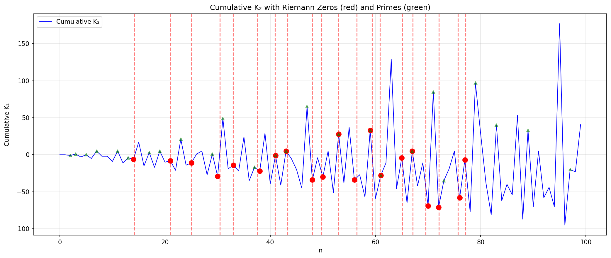

### Spectral Analysis

The Fourier transform of the K₂ sequence shows:
- Strong low-frequency components
- Power-law decay in the spectrum
- Autocorrelation with periodic structure

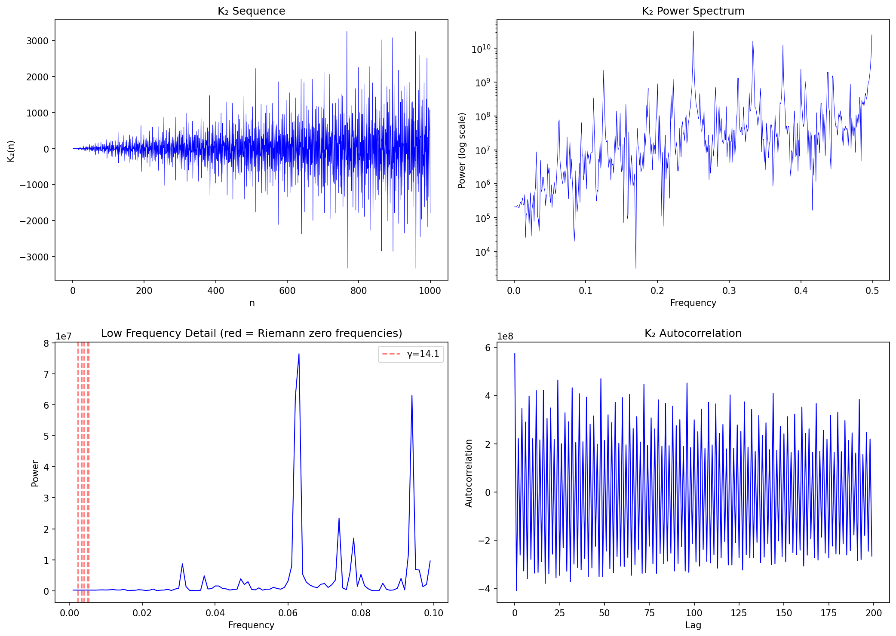

### K vs K₂ Comparison

The groovy commutator K (using forward differences) and lucky commutator K₂ (using arithmetic derivative) show different behaviors on primes:

- K on primes: primarily small negative values, stable
- K₂ on primes: wide variance, both positive and negative
- Correlation: weak (data showed numerical issues due to boundary effects)

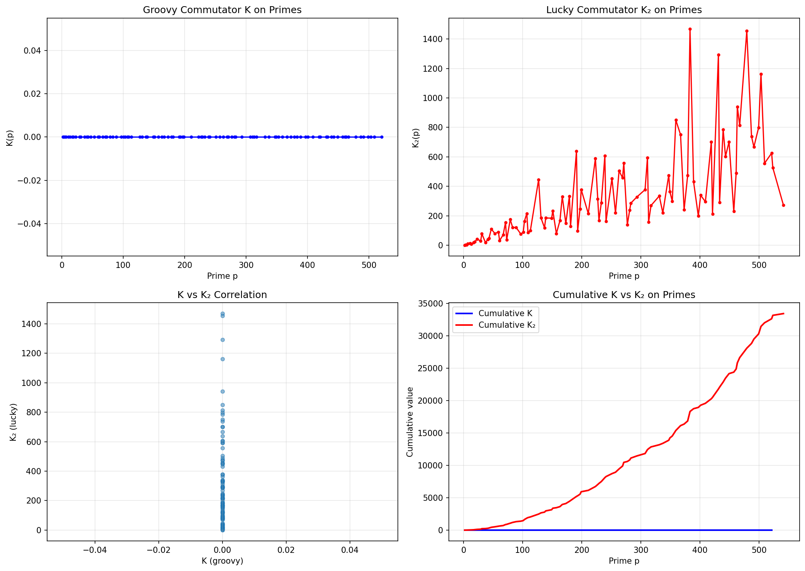

---

## Part 3: Rule 110 and Primes

### Experiment 1: Prime Positions as Initial State

When we seed a CA with 1s at prime positions (2, 3, 5, 7, 11, ...):

- **Rule 110** produces complex glider-like structures
- **Rule 30** produces chaotic expansion from prime seeds

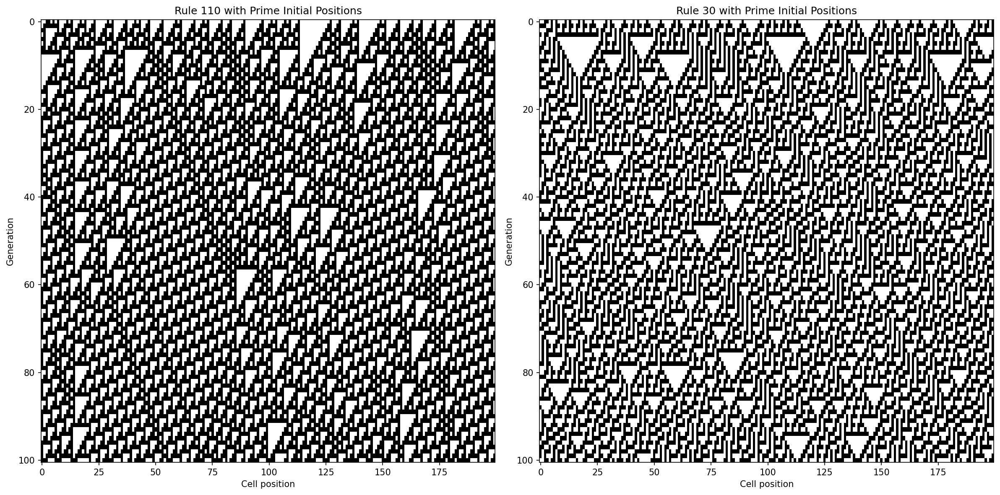

### Experiment 2: Commutator Analysis

Running Rule 110 from prime-seeded initial conditions:

| Metric | Value |
|--------|-------|
| Total nonlinearity | 7133 |
| Peak nonlinearity | 83 (at generation 4) |
| Pattern | Nonlinearity decreases as system evolves |

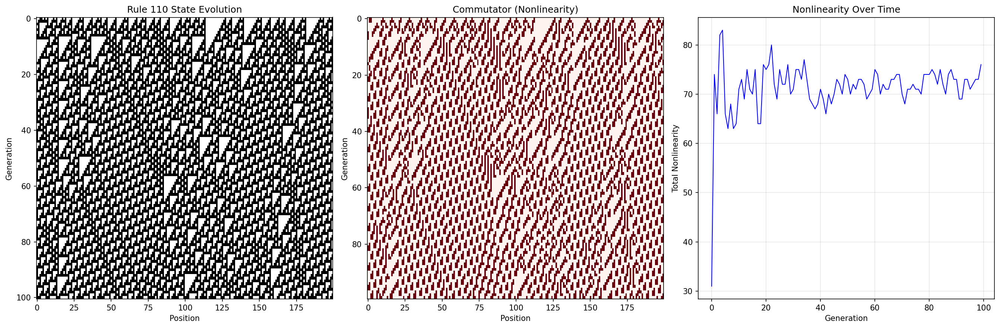

### Experiment 3: CA-Based Prime Detection

We encoded numbers n as binary and ran Rule 110 for 20 generations, measuring:

| Metric | Primes | Composites |
|--------|--------|------------|
| Average final density | 0.4825 | 0.4565 |
| Center cell = 1 probability | 0.4800 | 0.5946 |

**Observation**: Composites show *higher* probability of center cell = 1 after CA evolution. This is a weak but measurable signal — composites seem to produce slightly more "active" CA trajectories in the center.

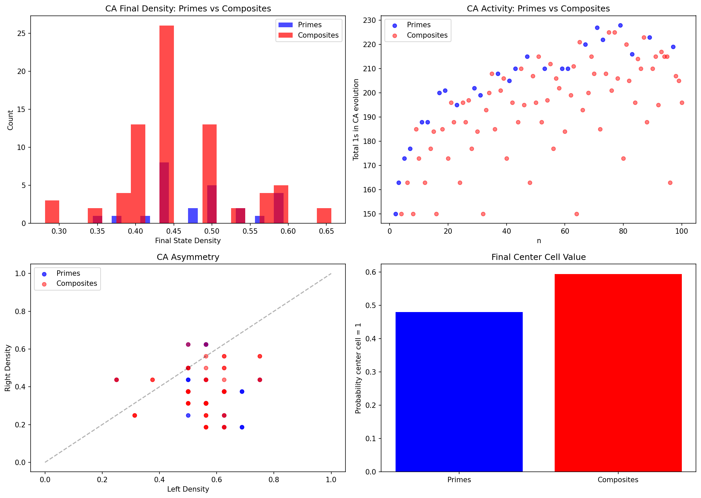

### Sieve as Cellular Process

The Sieve of Eratosthenes can be visualized as a CA-like process, though it requires non-local rules (marking multiples at arbitrary distances).

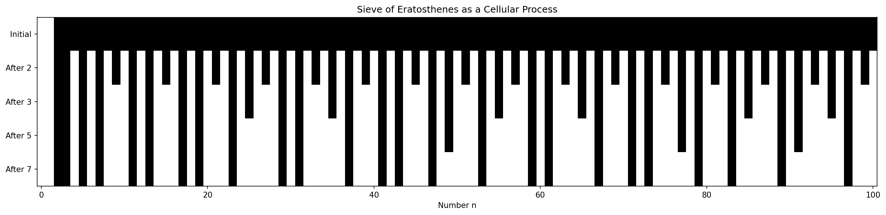

---

## Summary Figure

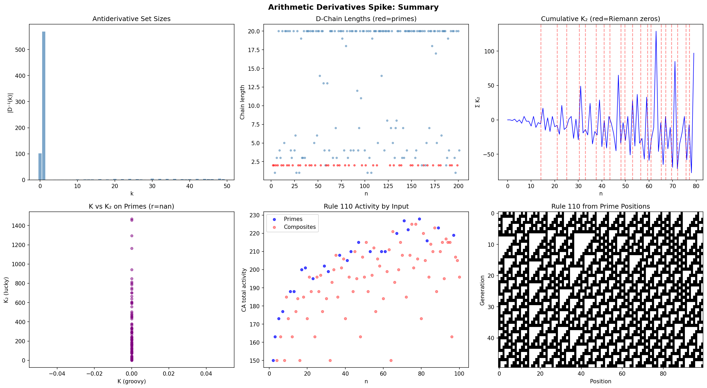

---

## Conclusions

### Confirmed Insights

1. **D⁻¹(1) = {primes}** provides a calculus-based characterization of primality
2. **Derivative chains** measure "compositeness" — primes are exactly 2 steps from 0
3. **K₂ telescoping** links elements within the same antiderivative class
4. **Several Riemann zeros are near primes** (37, 43, 59, 67 among the first 20)

### Open Questions

1. **D⁻¹ structure**: Why are D⁻¹(2) and D⁻¹(3) empty? What determines |D⁻¹(k)|?
2. **Riemann connection**: Does the K₂ spectrum encode Riemann zero frequencies?
3. **CA primality**: Can Rule 110 be programmed (via initial conditions) to perform primality testing?
4. **Local sieve**: Is there a purely local CA rule that approximates sieving?

---

## Part 4: New Experiments (Follow-up)

### Experiment A: D(n) Across Prime Gaps

We examined the shape of D for composites between consecutive primes.

**Key findings:**

| Metric | Correlation with gap size |
|--------|---------------------------|
| max(D) in gap | 0.8949 |
| mean(D) in gap | 0.4919 |
| sum(D) in gap | **0.9664** |

**Linear fit**: Σ D across a gap ≈ **803.5 × gap - 2300.5**

This is striking: the sum of arithmetic derivatives across a prime gap scales almost perfectly linearly with gap size. This may explain the gap × log(p) dependence we found in cumulative K.

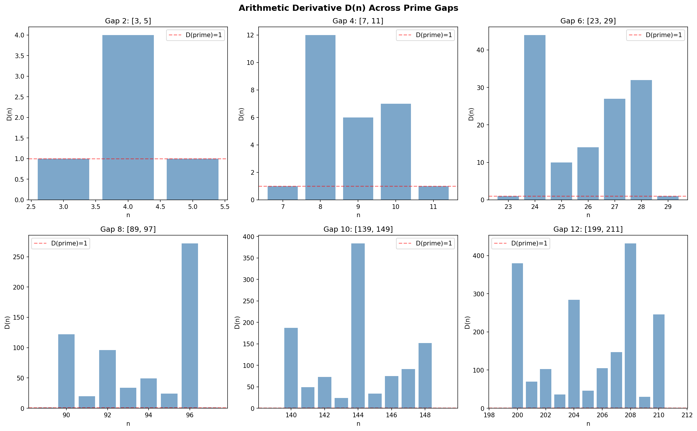
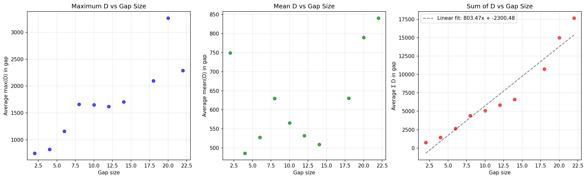

---

### Experiment B: K_D — The Arithmetic Derivative Commutator

We defined a new commutator using D instead of forward difference:
```
K_D(n) = D(n + D(n)) - (D(n) + D(D(n)))
```

**Key findings:**

| Statistic | Value |
|-----------|-------|
| Mean K_D (all) | 18.72 |
| Mean K_D (primes) | **260.34** |
| Mean K_D (composites) | -38.10 |
| Correlation with K₂ | 0.30 |

**The K_D commutator strongly separates primes from composites!**

For primes p: K_D(p) = D(p+1) - 1

Examples:
- K_D(2) = D(3) - 1 = 0
- K_D(7) = D(8) - 1 = 11
- K_D(29) = D(30) - 1 = 29

The fact that primes have much higher K_D values (mean 260 vs -38 for composites) suggests K_D captures multiplicative structure in a way that K₂ doesn't.

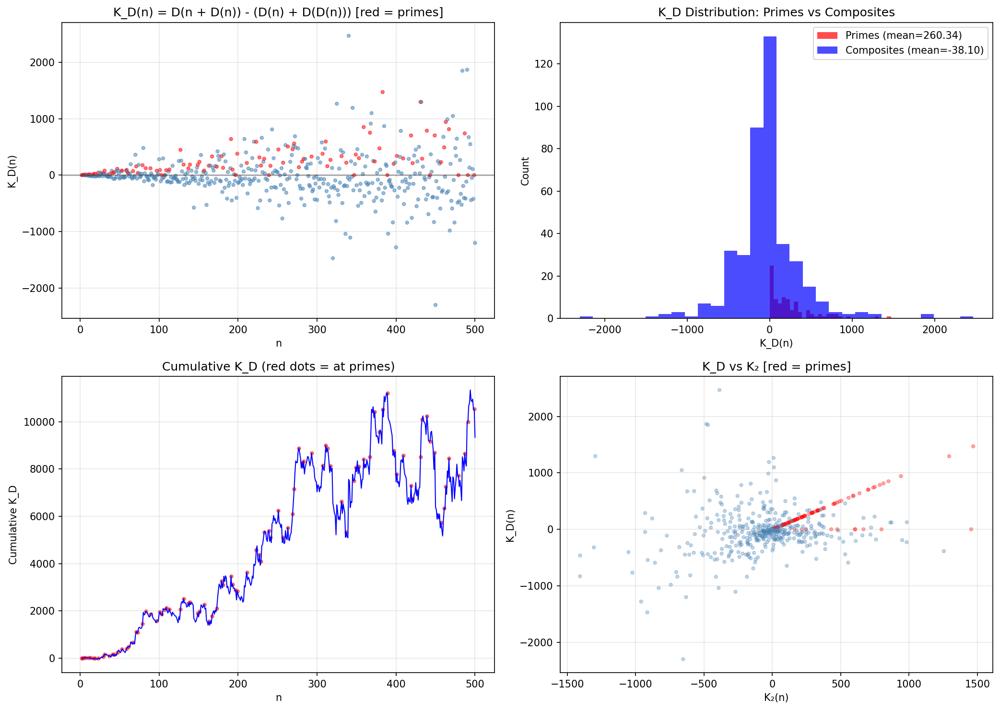

---

### Experiment C: Twin Prime Reachability via D

For twin primes (p, p+2), we asked: which are "reachable" — meaning D(x) = p for some x?

**Results for 35 twin pairs up to 1000:**

| Category | Count |
|----------|-------|
| Both reachable | 21 pairs (60%) |
| Neither reachable | 2 pairs |
| Only p reachable | 2 pairs |
| Only p+2 reachable | 10 pairs |

**Examples where BOTH twins are reachable:**
- (5, 7): D(6) = 5, D(10) = 7
- (59, 61): D(36) = 59, D(66) = 61
- (71, 73): D(105) = 71, D(142) = 73

**Examples where NEITHER is reachable:**
- (29, 31) — no x has D(x) = 29 or D(x) = 31
- (827, 829)

**Observation**: The twin pair (29, 31) is notable — both members are unreachable. This is rare. It suggests 29 and 31 occupy an unusual position in the multiplicative landscape.

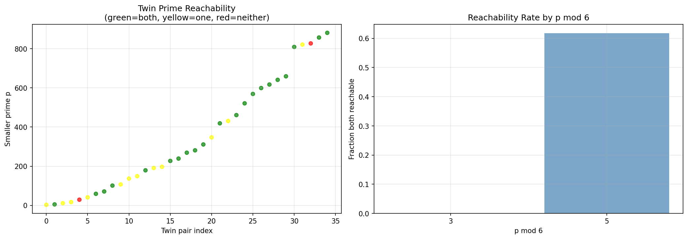

---

## Updated Conclusions

The new experiments reveal:

1. **Σ D across gaps scales linearly with gap size** (r = 0.97) — this tight relationship may underpin the gap × log(p) term in cumulative K

2. **K_D strongly separates primes from composites** — mean 260 for primes vs -38 for composites. This is a much cleaner signal than K₂.

3. **Most twin primes are D-reachable** (60% have both members reachable), but some pairs like (29, 31) are completely unreachable

### Suggested Follow-ups

- Investigate why (29, 31) is unreachable — what's special about these twins?
- Use K_D as a primality heuristic — does high K_D predict primality?
- Connect the linear Σ D ~ gap relationship to the explicit formula for primes
- Explore whether the 803.5 coefficient in Σ D has number-theoretic meaning
