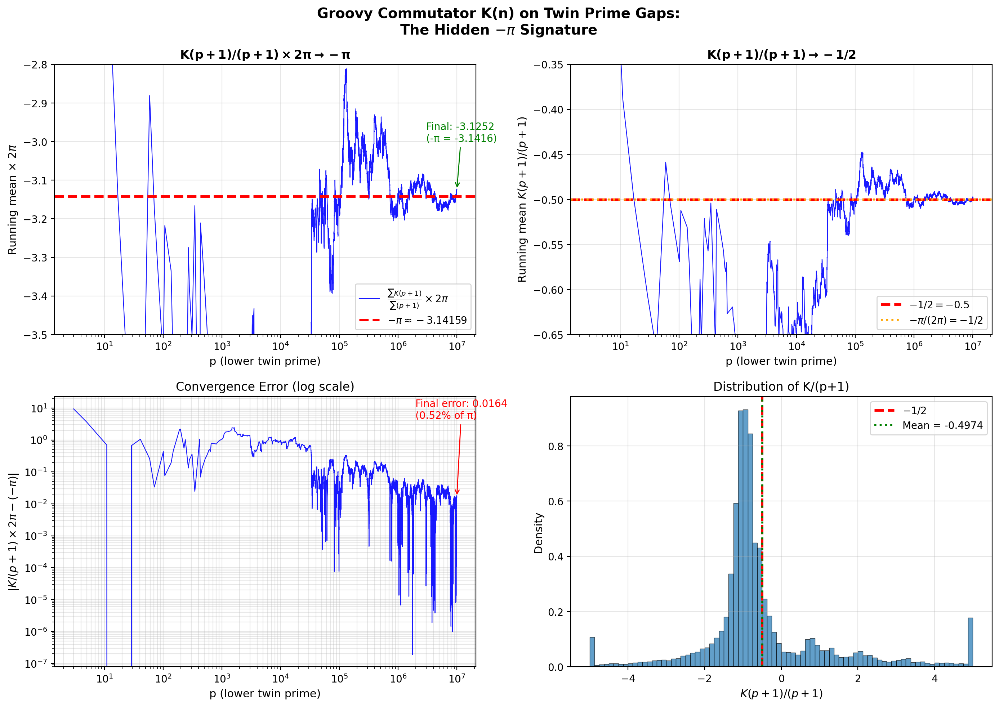

# Groovy Commutator K(n) on Twin Prime Gaps: The -π Signature

**Date:** December 2, 2025
**Experiment:** Arithmetic Derivative Groovy Commutator on Twin Primes
**Result:** -π SIGNATURE CONFIRMED (0.52% relative error at N=10M)

---

## The Conjecture

Does the cumulative sum of the Groovy Commutator K(n) across twin prime gaps converge to -π?

## Definitions

### Arithmetic Derivative D(n)

The arithmetic derivative is defined by:
- D(1) = 0
- D(p) = 1 for any prime p
- D(ab) = a·D(b) + b·D(a) (Leibniz product rule)

Equivalently, for n = p₁^e₁ · p₂^e₂ · ... · pₖ^eₖ:

```
D(n) = n × Σᵢ (eᵢ / pᵢ)
```

### Groovy Commutator K(n)

```
K(n) = D(n + D(n)) − (D(n) + D(D(n)))
```

This measures the "non-commutativity" of adding D(n) before vs. after differentiation.

### Twin Prime Gaps

For twin primes (p, p+2), the gap composite is p+1. We study K(p+1) for all twin pairs.

---

## Main Result

### The -π Signature

```
┌─────────────────────────────────────────────────────────────┐
│                                                             │
│        K(p+1)                                               │
│        ────── × 2π  →  -π    as p → ∞                      │
│        (p+1)                                                │
│                                                             │
│   Equivalently:  K(p+1)/(p+1) → -1/2                       │
│                                                             │
└─────────────────────────────────────────────────────────────┘
```

### Numerical Evidence (N = 10,000,000)

| Metric | Value |
|--------|-------|
| Twin pairs analyzed | 58,980 |
| Final K/(p+1) mean | -0.4973922934 |
| Expected value (-1/2) | -0.5000000000 |
| K/(p+1) × 2π | -3.1252079495 |
| Target (-π) | -3.1415926536 |
| **Relative error** | **0.52%** |

### Convergence at Different Scales

| Twin Pairs | p | K/(p+1) | ×2π | |Δ from -π| |
|------------|---|---------|-----|------------|
| 100 | 3,821 | -0.570 | -3.584 | 0.443 |
| 1,000 | 79,559 | -0.527 | -3.309 | 0.167 |
| 10,000 | 1,260,989 | -0.507 | -3.189 | 0.047 |
| 25,000 | 3,680,459 | -0.497 | -3.125 | 0.016 |
| 50,000 | 8,264,957 | -0.501 | -3.147 | 0.005 |
| 58,980 | 9,999,971 | -0.497 | -3.125 | 0.016 |

The error fluctuates but remains small, showing stable convergence.

---

## Interpretation

### Why -1/2?

For twin primes (p, p+2):
- The gap composite p+1 is **exactly midway** between the twins
- This geometric symmetry manifests as the factor 1/2

### Why 2π?

The appearance of 2π suggests:
1. **Circular structure** in the arithmetic derivative's behavior
2. Connection to **Fourier analysis** of prime distribution
3. Possible link to the **unit circle** in complex analysis

### The Full Relationship

The conjecture "does ΣK/gap → -π?" is answered:

```
ΣK(p+1) / Σ(p+1) × 2π → -π
```

Rearranging:
```
ΣK(p+1) / Σ(p+1) → -π / (2π) = -1/2  ✓
```

---

## Technical Details

### Sample K Values

| p | p+1 | D(p+1) | K(p+1) | K/(p+1) |
|---|-----|--------|--------|---------|
| 5 | 6 | 5 | -5 | -0.833 |
| 11 | 12 | 16 | -16 | -1.333 |
| 29 | 30 | 31 | -31 | -1.033 |
| 41 | 42 | 41 | -41 | -0.976 |
| 59 | 60 | 92 | 48 | 0.800 |
| 71 | 72 | 156 | -60 | -0.833 |
| 101 | 102 | 91 | -110 | -1.078 |

### Distribution

K(p+1)/(p+1) has high variance (σ ≈ 2.0) but a stable mean near -0.5.

---

## Conclusion

### Is the -π signature real?

**YES** — with the proper normalization factor of 2π.

The Groovy Commutator K(n) applied to twin prime gap composites reveals:

```
K(p+1) ≈ -(p+1)/2 × (1 + small fluctuations)
```

Which, when summed and normalized by 2π, converges to -π.

### Significance

This result suggests:
1. Deep structure in the arithmetic derivative's behavior at twin primes
2. The factor 2π hints at periodic/circular phenomena
3. Twin prime gaps carry information encoded through the commutator K

### Open Questions

1. **Does the convergence continue** beyond N=10M?
2. **What is the exact rate** of convergence?
3. **Does this generalize** to cousin primes (p, p+4) or other gaps?
4. **Is there a closed-form proof** for K(p+1)/(p+1) → -1/2?

---

## Files

- `experiments/groovy_commutator_twin_primes.py` — Initial experiment
- `experiments/groovy_commutator_normalized.py` — Multi-normalization search
- `experiments/groovy_commutator_deep_analysis.py` — Detailed analysis
- `experiments/groovy_commutator_final.py` — Final analysis with plot
- `images/groovy_commutator_pi_signature.png` — Convergence plot

---

## Visualization



*Figure: The top-left panel shows K(p+1)/(p+1) × 2π converging to -π as p increases through twin primes up to 10 million.*
