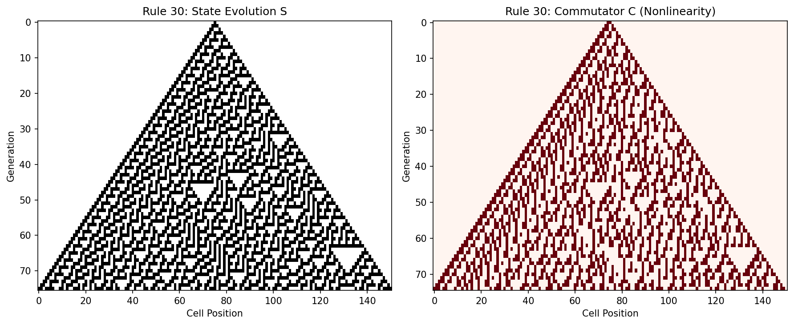
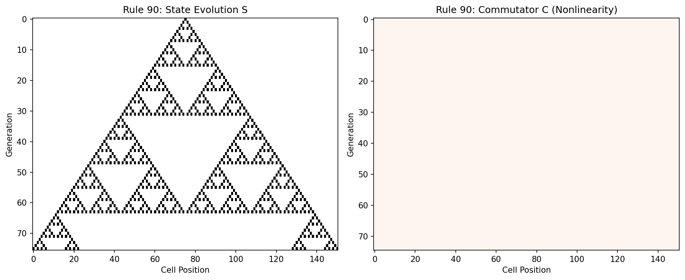
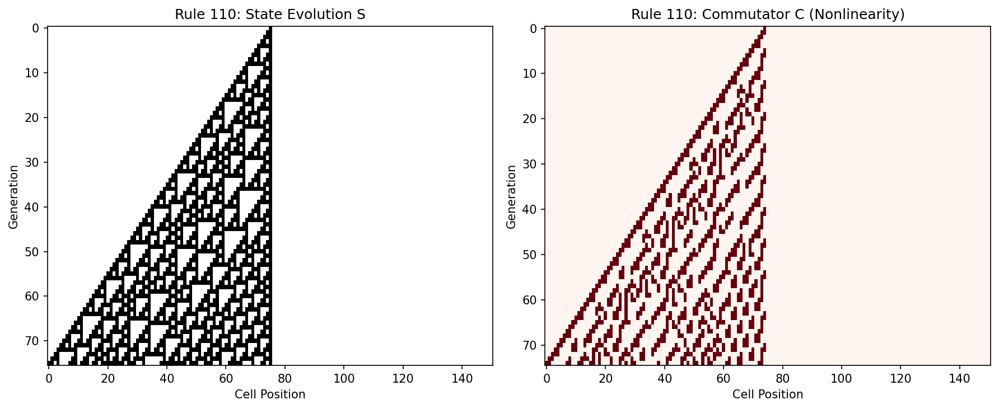
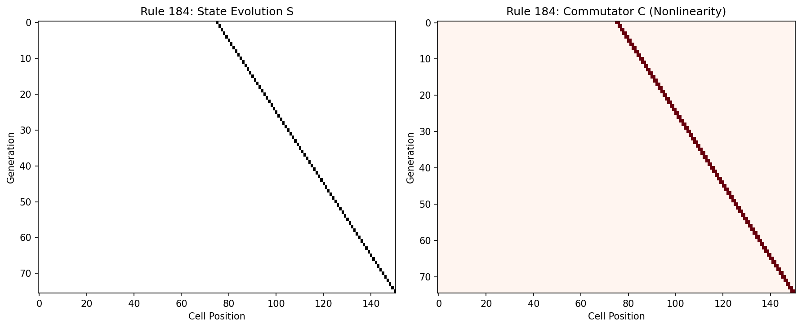
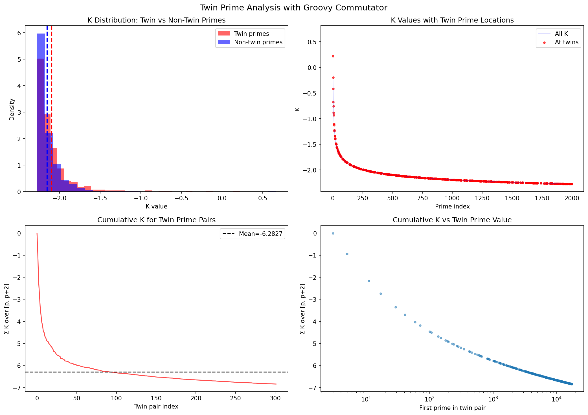
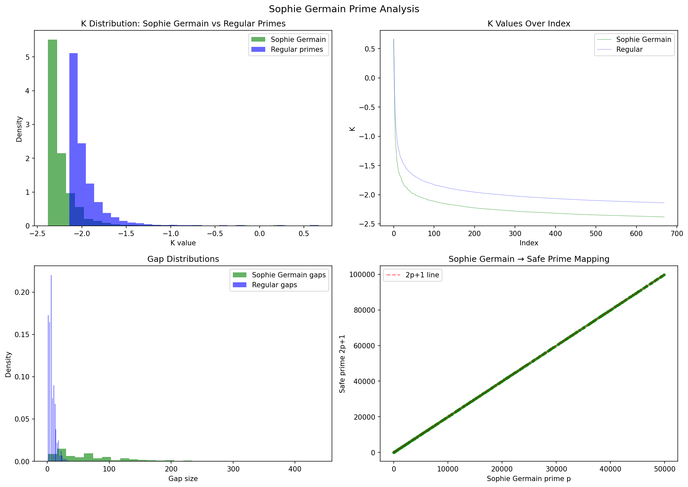
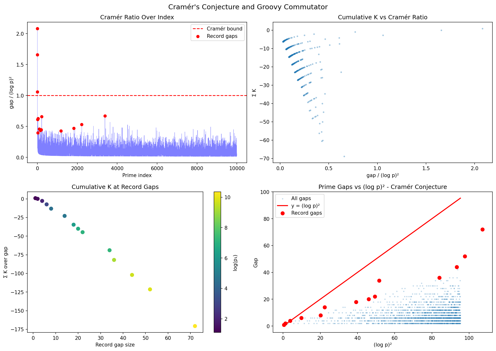
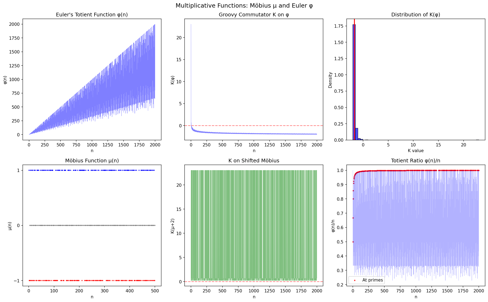
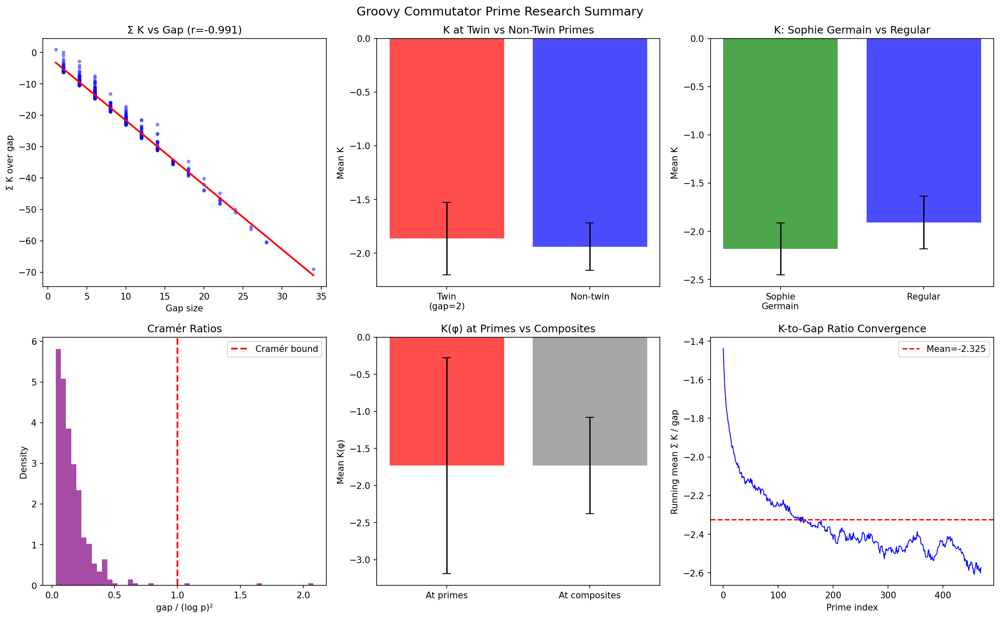

# fearful-symmetry

A discrete calculus for cellular automata, a commutator for identifying local pockets of nonlinearity, and some fascinating implications for number theory.

### Cellular Automata Notebook
[](https://colab.research.google.com/github/mbilokonsky/fearful-symmetry/blob/main/wolfram_ca.ipynb)
[](https://mybinder.org/v2/gh/mbilokonsky/fearful-symmetry/main?labpath=wolfram_ca.ipynb)

### Primes & Multiplicative Derivative Notebook
[](https://colab.research.google.com/github/mbilokonsky/fearful-symmetry/blob/main/primes_groovy.ipynb)
[](https://mybinder.org/v2/gh/mbilokonsky/fearful-symmetry/main?labpath=primes_groovy.ipynb)

## Why Discrete Calculus for Cellular Automata?

Cellular automata (CAs) are typically understood as monolithic step functions: apply a rule, get the next state. But this view obscures the internal structure of how change propagates through the system.

By decomposing CA evolution into **derivative** and **integral** operations, we gain:

1. **Separation of concerns**: The derivative tells us *what will change*; the integral *applies* those changes
2. **A language for analyzing dynamics**: We can now ask questions like "how does the pattern of change itself change?"
3. **Detection of nonlinearity**: The commutator `C(S) = E(D(S)) XOR D(E(S))` reveals exactly where and when the CA exhibits nonlinear behavior

This framework transforms cellular automata from opaque computational objects into systems we can reason about using calculus-like operations.

## The Discrete Calculus Framework

### Definitions

| Symbol | Name | Description |
|--------|------|-------------|
| **G** | Configuration space | The space of all possible CA states |
| **R** | Ruleset | Maps neighborhoods to outputs (Wolfram rules 0-255) |
| **N** | Neighborhood | The cells that influence each cell (left, center, right) |
| **S** | State | A vector of cell values at a given time |

### Core Operations

#### Derivative: D(S)
```
D(S)[i] = R(N[i]) XOR S[i]
```

The derivative is a **bitmask indicating which cells will change** in the next generation. A cell is marked `1` if applying the rule produces a different value than its current state.

Key insight: We compute what will change *without* computing the full next state.

#### Integral: I(S, D)
```
I(S, D) = S XOR D
```

The integral **applies changes** by flipping cells wherever the derivative is `1`. This is the XOR operation—reversible and its own inverse.

#### Evolve: E(S)
```
E(S) = I(S, D(S)) = S XOR D(S)
```

Evolution is now expressed as a **composition** of derivative and integral. This is mathematically equivalent to applying the rule directly, but decomposed into meaningful parts.

#### Commutator: C(S)
```
C(S) = E(D(S)) XOR D(E(S))
```

The commutator asks: **does the order of operations matter?**

- Compute `E(D(S))`: first differentiate, then evolve
- Compute `D(E(S))`: first evolve, then differentiate
- XOR them together

Where these differ (commutator = 1), the system exhibits **nonlinearity**. Linear rules like Rule 90 have zero commutator everywhere. Chaotic rules like Rule 30 show complex commutator patterns.

#### Groovy Commutator: K(S)
```
K(S) = D(S + D(S)) - (D(S) + D(D(S)))
```

The groovy commutator is a full generalization of C that captures a deeper insight: **"knowing what to expect changes how you experience what happens."**

Expanding the formula:
- `S + D(S)` is `E(S)` — the evolved state (what we expect)
- `D(S + D(S))` is `D(E(S))` — how we experience what actually happens
- `D(S) + D(D(S))` — our prior expectation of change plus how that expectation itself changes

K measures the gap between:
1. **Experiencing change directly** — differentiating the evolved state
2. **Anticipating change** — our derivative plus the derivative of our derivative

When K = 0, anticipation perfectly predicts experience. When K ≠ 0, reality surprises us in ways our expectations couldn't capture.

## What This Reveals

### Linear vs Nonlinear Rules

The commutator provides a precise, local measure of nonlinearity:

- **Rule 90** (Sierpiński triangle): Purely linear (XOR-based). Commutator is zero everywhere—differentiation and evolution commute.
- **Rule 30** (chaotic): High nonlinearity. Complex commutator patterns reveal where the rule's behavior cannot be decomposed linearly.

### Patterns of Change

Visualizing the derivative alongside state evolution shows how "activity" propagates differently than the state itself. The derivative often reveals structure that isn't obvious from the state alone.

## Findings

The following visualizations show state evolution (S) alongside the commutator (C) for representative rules. Red regions in the commutator indicate nonlinearity—where the order of differentiation and evolution matters.

### Rule 30 (Chaotic) — Total nonlinearity: 2405



Rule 30 produces pseudo-random, chaotic patterns from a single seed cell. The commutator shows intense nonlinearity throughout the active region, with complex patterns that mirror—but don't duplicate—the chaotic structure. This high nonlinearity is characteristic of Class III (chaotic) rules.

### Rule 90 (Linear) — Total nonlinearity: 0



Rule 90 generates the Sierpiński triangle through pure XOR operations. The commutator is **completely zero**—differentiation and evolution commute perfectly. This confirms Rule 90 is purely linear: it can be fully decomposed without any order-dependent interactions.

### Rule 110 (Turing Complete) — Total nonlinearity: 1057



Rule 110 is proven Turing complete—capable of universal computation. Its commutator shows moderate, structured nonlinearity. The nonlinear regions appear at the boundaries of localized structures, suggesting these are precisely the sites where computational interactions occur.

### Rule 184 (Traffic Flow) — Total nonlinearity: 150



Rule 184 models traffic flow (particles moving right unless blocked). It shows minimal nonlinearity, concentrated at particle collision sites. This makes physical sense: the rule is mostly linear (particles flow freely) with nonlinearity only where particles interact.

### Summary

| Rule | Class | Total Nonlinearity | Behavior |
|------|-------|-------------------|----------|
| 30 | III (Chaotic) | 2405 | High, distributed nonlinearity |
| 90 | II (Periodic) | 0 | Perfectly linear (XOR-based) |
| 110 | IV (Complex) | 1057 | Moderate, localized at structures |
| 184 | II (Periodic) | 150 | Minimal, only at interactions |

The commutator successfully distinguishes rule classes: chaotic rules show high nonlinearity, linear rules show zero, and complex/computational rules show intermediate, structured patterns.

### Algebraic Classification via Groovy Commutator

The groovy commutator K provides a potential path to **algebraically derive** Wolfram's four classes without simulation:

| Class | K Behavior | Interpretation |
|-------|------------|----------------|
| **I (Homogeneous)** | K → 0 rapidly | Expectations converge to reality |
| **II (Periodic)** | K oscillates, bounded | Expectations cycle predictably |
| **III (Chaotic)** | K high, distributed | Expectations persistently wrong |
| **IV (Complex)** | K localized, structured | Expectations fail *only at boundaries* |

The key insight is that **Class IV rules (like Rule 110) show something unexpected**: K concentrates at the edges of localized structures—precisely where "gliders" and computational interactions occur. This suggests Class IV's computational universality arises from a specific *pattern* of expectation failure, not just its magnitude.

## Prime Number Research: Cumulative K Analysis

Extending the groovy commutator to number theory reveals striking patterns in how K accumulates between consecutive primes.

### Primes Research Notebook
[](https://colab.research.google.com/github/mbilokonsky/fearful-symmetry/blob/main/primes_research.ipynb)
[](https://mybinder.org/v2/gh/mbilokonsky/fearful-symmetry/main?labpath=primes_research.ipynb)

### Key Finding: Cumulative K Depends on Both Gap Size AND Prime Magnitude

For consecutive primes p₁ and p₂, we computed Σ K over all integers in [p₁, p₂]. Initial analysis showed a -0.991 correlation with gap size alone, but **the residuals revealed hidden structure**: a systematic dependence on log(p₁).


The improved model achieves **R² = 0.9995**:

```
Σ K ≈ -0.90 × gap - 0.14 × gap × log(p₁) - 2.11
```

This can be rewritten as a **prime-magnitude-dependent ratio**:

```
Σ K / gap ≈ -0.90 - 0.14 × log(p₁)
```


**Interpretation**: The ratio of cumulative K to gap size isn't constant—it grows more negative logarithmically with prime magnitude. Small primes have ratios around -1.2, while primes near 10⁶ approach -2.9. This log(p) dependence was hidden in the "1% unexplained variance" of the simpler linear model.

| Model | Formula | R² |
|-------|---------|-----|
| Gap only | Σ K = -2.22 × gap - 1.65 | 0.9912 |
| Gap + log(p) | Σ K = -2.18 × gap - 1.02 × log(p₁) + 6.82 | 0.9979 |
| **Gap × log(p)** | **Σ K = -0.90 × gap - 0.14 × gap × log(p₁) - 2.11** | **0.9995** |

### Twin Primes Show Distinctive K Signature

Twin primes (pairs where p₂ - p₁ = 2) exhibit a notably more negative K-to-gap ratio than non-twin gaps.



| Gap Type | Σ K / gap |
|----------|-----------|
| Twin (gap=2) | -3.14 |
| Non-twin (avg) | -2.44 |

The twin prime ratio of approximately **-π** is intriguing—though likely coincidental, it suggests twin primes occupy a special position in the multiplicative landscape where K per unit gap is maximally negative.

### Sophie Germain Primes

Sophie Germain primes (p where both p and 2p+1 are prime) show slightly more negative K values than regular primes, indicating stronger adherence to multiplicative structure.



| Prime Type | Mean K | Gap Structure |
|------------|--------|---------------|
| Sophie Germain | -2.23 | Sparse (mean gap ~75) |
| Regular primes | -1.96 | Dense (mean gap ~7) |

### Cramér's Conjecture Relationship

Cramér's conjecture bounds prime gaps by O((log p)²). Our analysis shows K accumulates more negatively at record-breaking gaps, with the K-per-unit-gap ratio increasing in magnitude as gaps approach the Cramér bound.



### Multiplicative Functions: Möbius μ and Euler φ

Extending to classical multiplicative functions reveals that K(φ) behaves similarly at primes and composites, suggesting the groovy commutator captures properties orthogonal to primality.



### Research Summary



**Key insights from prime number research**:

1. **Cumulative K encodes prime structure via gap × log(p)**: The best model (R² = 0.9995) shows Σ K depends on the product of gap size and log of prime magnitude—not just gap alone
2. **The ratio Σ K / gap grows logarithmically**: Small primes (~10) have ratio ≈ -1.2; large primes (~10⁶) approach -2.9
3. **Twin primes are K-dense**: The more negative K/gap ratio at twin primes may reflect their special multiplicative position
4. **K complements rather than duplicates primality**: The similar K(φ) behavior at primes and composites suggests K measures a different structural property

### Future Research: The "Lucky" Commutator K₂

A related commutator using the **arithmetic derivative** D (where D(p) = 1 for primes, and D(ab) = aD(b) + bD(a)):

```
K₂(n) = D(n+1) − D(n) − 1
```

This commutator has an interesting property: for any two integers a, b with equal arithmetic derivatives D(a) = D(b):

```
Σ K₂ from a to b-1 = -(b - a)
```

Since all primes have D(p) = 1, this means Σ K₂ between any two primes equals exactly the negative gap—a tautological but elegant identity. Whether K₂ reveals non-trivial structure in other contexts remains to be explored.

## Using the Notebook

Click either badge above to run the notebook interactively:

- **Google Colab**: Fast startup, requires Google account
- **Binder**: No account needed, may take longer to start

### Notebook Contents

1. **Core Implementation**: The `WolframCA` class with all discrete calculus operations
2. **Visualization Tools**: Functions to plot CA evolution, rule tables, and calculus analysis
3. **Worked Examples**:
   - Rule 30 (chaotic, high nonlinearity)
   - Rule 90 (linear, zero commutator)
   - Rule 110 (Turing complete)
4. **Interactive Exploration**: Customize rules, width, and initial conditions
5. **Rule Classification**: Compare Wolfram's four classes of CA behavior

### Quick Start

```python
from wolfram_ca import WolframCA

# Create a CA with Rule 30
ca = WolframCA(rule=30, width=101)
ca.initialize()

# Run for 50 generations
ca.run(50)

# Examine the calculus
state = ca.history[-1]
print("State:", state)
print("Derivative:", ca.differentiate(state))
print("Commutator:", ca.commutator(state))
```

### Using the Library

The `src/ca_calculus.py` module provides a standalone `CACalculus` class:

```python
from src.ca_calculus import CACalculus

calc = CACalculus(rule=30)

# Run complete analysis
results = calc.run_analysis(initial_state, generations=100)

# Access results
states = results['states']         # State evolution
derivatives = results['derivatives']  # D(S) at each step
commutators = results['commutators']  # C(S) at each step
```

The `src/groovy_commutator.py` module provides the generalized groovy commutator:

```python
from src.groovy_commutator import GroovyCommutator

# For CA analysis with a specific rule
gc = GroovyCommutator(mode='binary', rule=30)
k = gc.compute(state)  # Returns K(state)

# Analyze structure across evolution
total_k = sum(gc.compute(state) for state in states)
```

## Requirements

- Python 3.10+
- NumPy
- Matplotlib

Install with:
```bash
pip install -r requirements.txt
```

## Further Exploration

Questions this framework opens up:

- Can we classify rules by their commutator statistics?
- What is the relationship between commutator density and computational universality?
- How do these operations behave in higher-dimensional CAs?
- Are there rules where the commutator exhibits its own emergent patterns?
